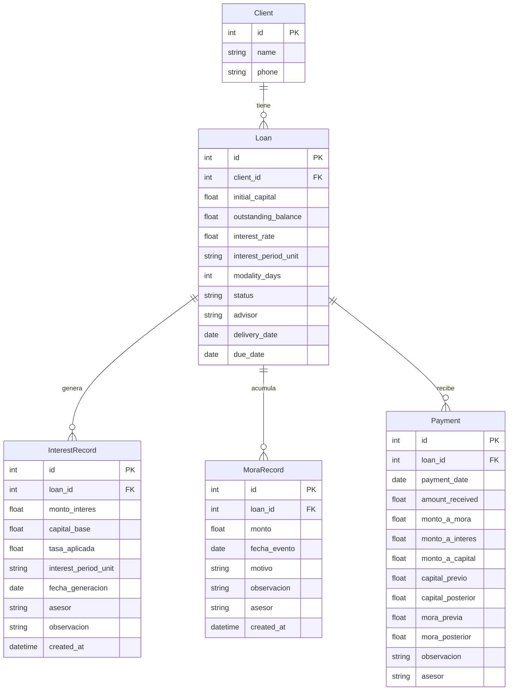

# Design Document — Motor Financiero DLHB-CORE

## Overview

El Motor Financiero es la capa de servicios que centraliza toda la lógica de créditos en DLHB-CORE. Reemplaza la lógica ad-hoc de `main.py` con un conjunto de servicios puros, testeables y auditables que implementan:

- Cálculo de interés sobre saldo insoluto con soporte de tres unidades de tasa (`mensual`, `anual`, `por_periodo`).
- Registro manual de intereses y moras (append-only) con validación en el backend.
- Aplicación de pagos bajo política de prioridad configurable con transición en caliente.
- Trazabilidad completa: cada Registro_Pago contiene un snapshot del estado financiero anterior y posterior.
- Estado calculado en tiempo real: `Interes_Pendiente` y `Mora_vigente` se derivan del historial, nunca de campos estáticos.

El motor vive en `app/services/financial_engine.py` y se expone a través de routers FastAPI organizados bajo `/creditos`. El frontend y el servidor MCP son consumidores puros de la API; ninguno implementa lógica financiera propia.

---

## Architecture

```mermaid
graph TD
    subgraph Clients
        FE[React Frontend]
        MCP[MCP Server]
    end

    subgraph FastAPI["FastAPI — app/"]
        R1[Router /creditos]
        R2[Router /creditos/{id}/intereses]
        R3[Router /creditos/{id}/moras]
        R4[Router /creditos/{id}/pagos]
    end

    subgraph Services["app/services/"]
        FE_SVC[financial_engine.py]
        IC[InterestCalculator]
        MS[MoraService]
        PE[PaymentEngine]
        LS[LoanStateService]
    end

    subgraph Models["SQLAlchemy Models"]
        LN[Loan]
        IR[InterestRecord]
        MR[MoraRecord]
        PY[Payment]
    end

    DB[(SQLite / PostgreSQL)]

    FE -->|HTTP JSON| R1
    FE -->|HTTP JSON| R2
    FE -->|HTTP JSON| R3
    FE -->|HTTP JSON| R4
    MCP -->|HTTP JSON| R1
    MCP -->|HTTP JSON| R2
    MCP -->|HTTP JSON| R3
    MCP -->|HTTP JSON| R4

    R1 --> LS
    R2 --> IC
    R3 --> MS
    R4 --> PE

    PE --> IC
    PE --> MS
    PE --> LS

    IC --> IR
    IC --> PY
    MS --> MR
    MS --> PY
    LS --> IR
    LS --> MR
    LS --> PY
    LS --> LN

    IC --> DB
    MS --> DB
    PE --> DB
    LS --> DB
```

**Principios arquitectónicos:**

1. **Sin lógica financiera en capas de presentación.** El frontend solo envía solicitudes y recibe resultados calculados (Req. 9).
2. **Servicios puros.** `financial_engine.py` no importa FastAPI. Sus funciones son testeables sin contexto HTTP.
3. **Append-only para registros de auditoría.** `InterestRecord` y `MoraRecord` nunca se modifican ni eliminan en la capa de servicio.
4. **Estado derivado.** `Interes_Pendiente` y `Mora_vigente` se calculan desde el historial en cada consulta; no existen como campos estáticos en `Loan`.
5. **Transacción ACID en pagos.** `PaymentEngine.apply_payment` ejecuta todo en una única transacción de base de datos.

---

## Components and Interfaces

### 1. `app/models.py` — SQLAlchemy Models

#### Enum `InterestPeriodUnit`

```python
class InterestPeriodUnit(str, PyEnum):
    MENSUAL = "mensual"
    ANUAL = "anual"
    POR_PERIODO = "por_periodo"
```

#### Enum `LoanStatus` (renombrado de `INACTIVO` → `CANCELADO`)

```python
class LoanStatus(str, PyEnum):
    ACTIVO = "ACTIVO"
    CANCELADO = "CANCELADO"
```

> **Backward compatibility:** La base de datos SQLite existente usa `INACTIVO`. Se incluye una migración Alembic (o script SQL) que renombra los valores `INACTIVO` → `CANCELADO` antes del primer despliegue del motor.

#### `Loan` (modificado)

```python
class Loan(Base):
    __tablename__ = "loans"

    id                  = Column(Integer, primary_key=True, index=True)
    client_id           = Column(Integer, ForeignKey("clients.id", ondelete="CASCADE"), nullable=False, index=True)
    initial_capital     = Column(Float, nullable=False)
    interest_rate       = Column(Float, nullable=False)           # decimal: ej. 0.20
    interest_period_unit = Column(Enum(InterestPeriodUnit), nullable=False, default=InterestPeriodUnit.POR_PERIODO)
    modality_days       = Column(Integer, nullable=False)         # periodicidad en días
    outstanding_balance = Column(Float, nullable=False)           # capital_pendiente
    status              = Column(Enum(LoanStatus), nullable=False, default=LoanStatus.ACTIVO)
    advisor             = Column(String(length=50), nullable=False)
    delivery_date       = Column(Date, nullable=False)
    due_date            = Column(Date, nullable=False)

    client           = relationship("Client", back_populates="loans")
    payments         = relationship("Payment", back_populates="loan", cascade="all, delete-orphan")
    interest_records = relationship("InterestRecord", back_populates="loan", cascade="all, delete-orphan")
    mora_records     = relationship("MoraRecord", back_populates="loan", cascade="all, delete-orphan")
```

**Campos no presentes (intencional):**
- `interes_pendiente`: campo calculado, nunca persistido (D1+D10, Req. 12 restricción explícita).

#### `InterestRecord` (nueva)

```python
class InterestRecord(Base):
    __tablename__ = "interest_records"

    id                  = Column(Integer, primary_key=True, index=True)
    loan_id             = Column(Integer, ForeignKey("loans.id", ondelete="CASCADE"), nullable=False, index=True)
    monto_interes       = Column(Float, nullable=False)
    capital_base        = Column(Float, nullable=False)           # capital_pendiente al momento del registro
    tasa_aplicada       = Column(Float, nullable=False)           # tasa efectiva del período aplicada
    interest_period_unit = Column(Enum(InterestPeriodUnit), nullable=False)
    fecha_generacion    = Column(Date, nullable=False)
    asesor              = Column(String(length=50), nullable=False)
    observacion         = Column(String(length=500), nullable=True)
    created_at          = Column(DateTime, server_default=func.now(), nullable=False)

    loan = relationship("Loan", back_populates="interest_records")
```

**Restricción de capa de servicio:** `InterestRecord` es append-only. La capa de servicio no ofrece métodos `update` ni `delete` para esta entidad.

#### `MoraRecord` (nueva)

```python
class MoraRecord(Base):
    __tablename__ = "mora_records"

    id           = Column(Integer, primary_key=True, index=True)
    loan_id      = Column(Integer, ForeignKey("loans.id", ondelete="CASCADE"), nullable=False, index=True)
    monto        = Column(Float, nullable=False)
    fecha_evento = Column(Date, nullable=False)
    motivo       = Column(String(length=255), nullable=False)
    observacion  = Column(String(length=500), nullable=True)
    asesor       = Column(String(length=50), nullable=False)
    created_at   = Column(DateTime, server_default=func.now(), nullable=False)

    loan = relationship("Loan", back_populates="mora_records")
```

**Restricción de capa de servicio:** `MoraRecord` es append-only (D9).

#### `Payment` (modificado)

```python
class Payment(Base):
    __tablename__ = "payments"

    id               = Column(Integer, primary_key=True, index=True)
    loan_id          = Column(Integer, ForeignKey("loans.id", ondelete="CASCADE"), nullable=False, index=True)
    payment_date     = Column(Date, nullable=False)
    amount_received  = Column(Float, nullable=False)          # monto total recibido

    # Distribución del pago (D11 — snapshot incluido)
    monto_a_mora     = Column(Float, nullable=False, default=0.0)
    monto_a_interes  = Column(Float, nullable=False, default=0.0)
    monto_a_capital  = Column(Float, nullable=False, default=0.0)

    # Backward compatibility (columnas alias, no nuevas columnas)
    # principal_payment → monto_a_capital  (synonym, mantenido para lectura de datos históricos)
    # interest_payment  → monto_a_interes  (synonym)

    # Snapshot de estado (D11)
    capital_previo   = Column(Float, nullable=False)
    capital_posterior = Column(Float, nullable=False)
    mora_previa      = Column(Float, nullable=False)
    mora_posterior   = Column(Float, nullable=False)

    # Metadatos
    observacion      = Column(String(length=500), nullable=True)
    asesor           = Column(String(length=50), nullable=False)

    loan = relationship("Loan", back_populates="payments")
```

**Estrategia de migración de columnas:** Se añaden las nuevas columnas con `ALTER TABLE`. Las filas existentes de `payments` tendrán `monto_a_mora=0`, `monto_a_capital=principal_payment`, `monto_a_interes=interest_payment`, con los campos de snapshot en `NULL` (nullable en migración, NOT NULL en filas nuevas).

---

### 2. `app/services/financial_engine.py` — Servicios Financieros

#### Tipos de datos de soporte

```python
from dataclasses import dataclass
from datetime import date
from typing import Optional

@dataclass
class LoanState:
    loan_id: int
    capital_inicial: float
    capital_pendiente: float
    interes_pendiente: float        # calculado desde historial
    mora_vigente: float             # calculada desde historial
    interes_periodo_siguiente: float  # capital_pendiente × tasa_del_periodo
    estado: str                     # ACTIVO | CANCELADO

@dataclass
class PaymentResult:
    payment_id: int
    monto_total: float
    monto_a_mora: float
    monto_a_interes: float
    monto_a_capital: float
    capital_previo: float
    capital_posterior: float
    mora_previa: float
    mora_posterior: float
    nuevo_estado: str
```

#### `InterestCalculator`

```python
class InterestCalculator:

    @staticmethod
    def convert_rate_to_period(rate: float, unit: InterestPeriodUnit, periodicidad_dias: int) -> float:
        """
        Convierte la tasa almacenada al equivalente para el período pactado.

        Reglas (D3):
        - POR_PERIODO: rate ya es la tasa del período → devuelve rate directamente.
        - MENSUAL:     rate es mensual, período en días → rate × (periodicidad_dias / 30)
        - ANUAL:       rate es anual, período en días  → rate × (periodicidad_dias / 365)

        Args:
            rate:              Tasa almacenada en el crédito (decimal, ej. 0.20).
            unit:              Unidad de la tasa.
            periodicidad_dias: Duración del período en días (modality_days).

        Returns:
            Tasa efectiva para el período como decimal.

        Raises:
            ValueError: Si rate <= 0 o periodicidad_dias <= 0 (D12).
        """

    @staticmethod
    def calculate_interest(
        capital_pendiente: float,
        rate: float,
        unit: InterestPeriodUnit,
        periodicidad_dias: int,
    ) -> float:
        """
        Calcula el monto de interés del período completo (D2).

        Resultado = capital_pendiente × convert_rate_to_period(rate, unit, periodicidad_dias)
        El interés es siempre el monto completo del período; sin prorrateo por días.

        Returns:
            Monto de interés (≥ 0).
        """

    @staticmethod
    def calculate_interes_pendiente(loan_id: int, db: Session) -> float:
        """
        Calcula el Interes_Pendiente vigente desde el historial (D1+D10).

        Fórmula: Σ(InterestRecord.monto_interes) − Σ(Payment.monto_a_interes)

        Returns:
            Interes_Pendiente ≥ 0. Nunca negativo.

        Raises:
            ValueError: Si el resultado calculado sería negativo (indica corrupción de datos).
        """
```

#### `MoraService`

```python
class MoraService:

    @staticmethod
    def calculate_mora_vigente(loan_id: int, db: Session) -> float:
        """
        Calcula la Mora vigente total desde el historial.

        Fórmula: Σ(MoraRecord.monto) − Σ(Payment.monto_a_mora)

        Returns:
            Mora_vigente ≥ 0.
        """

    @staticmethod
    def register_mora(
        loan_id: int,
        monto: float,
        fecha: date,
        motivo: str,
        observacion: Optional[str],
        asesor: str,
        db: Session,
    ) -> MoraRecord:
        """
        Persiste un nuevo MoraRecord (append-only).

        Validaciones:
        - Loan existe y está ACTIVO (no CANCELADO).
        - monto > 0.
        - fecha >= loan.delivery_date.

        Returns:
            MoraRecord recién persistido.

        Raises:
            ValueError: Si validaciones fallan.
        """

    @staticmethod
    def get_mora_records_fifo(loan_id: int, db: Session) -> list[MoraRecord]:
        """
        Retorna los MoraRecord del crédito ordenados por fecha_evento ASC (FIFO — D8).
        """
```

#### `PaymentEngine`

```python
class PaymentEngine:

    @staticmethod
    def apply_payment(
        loan_id: int,
        amount: float,
        fecha: date,
        observacion: Optional[str],
        asesor: str,
        db: Session,
    ) -> PaymentResult:
        """
        Motor central de aplicación de pagos. Todo ocurre en una única transacción ACID.

        Algoritmo (en orden):
        1. Cargar Loan. Validar ACTIVO y amount > 0.
        2. Calcular estado actual:
           - capital      = loan.outstanding_balance
           - interes_pend = InterestCalculator.calculate_interes_pendiente(loan_id, db)
           - mora_vig     = MoraService.calculate_mora_vigente(loan_id, db)
        3. Validar amount <= capital + interes_pend + mora_vig (Req. 6.2).
        4. Guardar snapshot: capital_previo = capital, mora_previa = mora_vig.
        5. Distribuir el pago:

           a) Si mora_vig > 0  (política: Mora → Capital, con hot-transition D4+D5):
              - monto_a_mora = min(amount, mora_vig) → descontar FIFO desde MoraRecords
              - sobrante = amount - monto_a_mora
              - Si sobrante > 0:
                  monto_a_interes = min(sobrante, interes_pend)
                  monto_a_capital = max(0.0, sobrante - monto_a_interes)
              - Else:
                  monto_a_interes = 0.0; monto_a_capital = 0.0

           b) Si mora_vig == 0  (política: Interés → Capital):
              - monto_a_mora = 0.0
              - monto_a_interes = min(amount, interes_pend)
              - monto_a_capital = max(0.0, amount - monto_a_interes)

        6. Actualizar loan.outstanding_balance -= monto_a_capital
        7. Calcular mora_posterior = mora_vig - monto_a_mora
        8. Calcular capital_posterior = capital - monto_a_capital
        9. Verificar condición de cancelación (D6+D7):
           - nuevo_interes_pend = interes_pend - monto_a_interes
           - Si capital_posterior == 0 AND nuevo_interes_pend == 0 AND mora_posterior == 0:
               loan.status = LoanStatus.CANCELADO
        10. Persistir Payment con todos los campos y snapshot.
        11. db.commit()

        Returns:
            PaymentResult con distribución completa y snapshot.

        Raises:
            ValueError: Validaciones de negocio.
            SQLAlchemyError: Re-raise tras rollback.
        """
```

#### `LoanStateService`

```python
class LoanStateService:

    @staticmethod
    def get_loan_state(loan_id: int, db: Session) -> LoanState:
        """
        Retorna el estado financiero completo y calculado del crédito.

        Calcula en tiempo real:
        - interes_pendiente  = InterestCalculator.calculate_interes_pendiente(loan_id, db)
        - mora_vigente       = MoraService.calculate_mora_vigente(loan_id, db)
        - interes_periodo_siguiente = InterestCalculator.calculate_interest(
              loan.outstanding_balance, loan.interest_rate,
              loan.interest_period_unit, loan.modality_days)

        Returns:
            LoanState con todos los campos.

        Raises:
            ValueError: Si loan_id no existe.
        """
```

---

## Data Models

### Diagrama de entidades



### Campos calculados (no persistidos)

| Campo | Fórmula | Dónde se computa |
|---|---|---|
| `interes_pendiente` | `Σ(InterestRecord.monto_interes) − Σ(Payment.monto_a_interes)` | `InterestCalculator.calculate_interes_pendiente()` |
| `mora_vigente` | `Σ(MoraRecord.monto) − Σ(Payment.monto_a_mora)` | `MoraService.calculate_mora_vigente()` |
| `interes_periodo_siguiente` | `capital_pendiente × tasa_efectiva_periodo` | `InterestCalculator.calculate_interest()` |

---

## Correctness Properties

*Una propiedad es una característica o comportamiento que debe mantenerse verdadero en todas las ejecuciones válidas de un sistema — esencialmente, un enunciado formal sobre lo que el sistema debe hacer. Las propiedades sirven como puente entre las especificaciones legibles por humanos y las garantías de corrección verificables por máquina.*

### Property 1: Cálculo de Interés del Período

*Para cualquier* par `(capital_pendiente ≥ 0, tasa_interes > 0)` y cualquier `interest_period_unit` válido, el resultado de `calculate_interest(capital_pendiente, rate, unit, periodicidad_dias)` debe ser exactamente igual a `capital_pendiente × convert_rate_to_period(rate, unit, periodicidad_dias)` y siempre `≥ 0`.

**Validates: Requirements 2.1, 2.7**

---

### Property 2: Conservación del Pago

*Para cualquier* pago aplicado con éxito, la suma `monto_a_mora + monto_a_interes + monto_a_capital` debe ser exactamente igual a `amount_received`.

**Validates: Requirements 3 (propiedades de corrección), 5 (propiedades de corrección), 7.1**

---

### Property 3: Reconstructibilidad del Capital Pendiente

*Para cualquier* secuencia de N pagos válidos aplicados a un crédito, el `capital_pendiente` actual debe ser exactamente igual a `initial_capital − Σ(Payment.monto_a_capital)` para todos los pagos del crédito.

**Validates: Requirements 7 (round-trip), 8.4**

---

### Property 4: Reconstructibilidad del Interés Pendiente

*Para cualquier* secuencia de registros de interés y pagos, el `interes_pendiente` calculado debe ser exactamente igual a `Σ(InterestRecord.monto_interes) − Σ(Payment.monto_a_interes)` y el resultado nunca debe ser negativo.

**Validates: Requirements 12.4, 2 (propiedades de corrección)**

---

### Property 5: Reconstructibilidad de la Mora Vigente

*Para cualquier* secuencia de registros de mora y pagos, la `mora_vigente` calculada debe ser exactamente igual a `Σ(MoraRecord.monto) − Σ(Payment.monto_a_mora)` y el resultado nunca debe ser negativo.

**Validates: Requirements 4.5, 8.5**

---

### Property 6: Invariante de Prioridad sin Mora (Interés → Capital)

*Para cualquier* pago donde `mora_vigente = 0` y `0 < amount ≤ interes_pendiente + capital_pendiente`, se debe cumplir:
- `monto_a_mora = 0`
- `monto_a_interes = min(amount, interes_pendiente)`
- `monto_a_capital = max(0, amount − interes_pendiente)`

**Validates: Requirements 3.1, 3.2, 3.3, 3.4**

---

### Property 7: Invariante de Prioridad con Mora (Mora → Capital)

*Para cualquier* pago donde `mora_vigente > 0` y el pago no supera `mora_vigente`, se debe cumplir:
- `monto_a_mora = amount`
- `monto_a_capital = 0`
- El `interes_pendiente` no varía respecto al estado previo al pago.

**Validates: Requirements 5.1, 5.2, 5.4**

---

### Property 8: Transición en Caliente (Hot Transition)

*Para cualquier* pago donde `mora_vigente > 0` y `amount > mora_vigente`, el sobrante `(amount − mora_vigente)` debe distribuirse bajo la política Interés → Capital en el mismo pago, de modo que:
- `monto_a_mora = mora_vigente`
- `monto_a_interes = min(sobrante, interes_pendiente)`
- `monto_a_capital = max(0, sobrante − interes_pendiente)`

**Validates: Requirements 5.3, 5.5**

---

### Property 9: Inmutabilidad del Capital Inicial

*Para cualquier* secuencia de pagos, registros de mora o registros de interés, el campo `initial_capital` de un crédito no debe cambiar respecto a su valor en el momento de creación.

**Validates: Requirements 1.8**

---

### Property 10: Consistencia del Snapshot de Pago

*Para cualquier* pago aplicado, los campos de snapshot deben satisfacer:
- `capital_posterior = capital_previo − monto_a_capital`
- `mora_posterior = mora_previa − monto_a_mora`
- `capital_posterior ≥ 0`
- `mora_posterior ≥ 0`

**Validates: Requirements 8.6**

---

### Property 11: Condición de Cancelación Estricta

*Para cualquier* crédito, el estado debe ser `CANCELADO` si y solo si `capital_pendiente = 0 AND interes_pendiente = 0 AND mora_vigente = 0` simultáneamente. Si cualquiera de los tres es mayor a cero, el estado debe ser `ACTIVO`.

**Validates: Requirements 6.3, 6.9**

---

### Property 12: Aplicación FIFO de Moras

*Para cualquier* lista de MoraRecords con diferentes `fecha_evento`, un pago que no alcance a cubrir todos los registros debe agotar primero los de fecha más antigua antes de afectar los más recientes.

**Validates: Requirements 5.6**

---

## Error Handling

### Errores de validación de negocio (HTTP 400 / 422)

| Condición | Código | Mensaje estructurado |
|---|---|---|
| `amount_received > total_owed` | 400 | `{"field": "amount_received", "detail": "El monto excede las obligaciones vigentes. Total adeudado: {X}"}` |
| `amount_received <= 0` | 422 | Validación Pydantic: `value must be greater than 0` |
| `interest_rate <= 0` | 422 | Validación Pydantic: `interest_rate must be greater than 0` |
| `initial_capital <= 0` | 422 | Validación Pydantic: `value must be greater than 0` |
| `modality_days <= 0` | 422 | Validación Pydantic: `value must be greater than 0` |
| `mora.monto <= 0` | 422 | Validación Pydantic: `value must be greater than 0` |
| Pago sobre crédito CANCELADO | 400 | `{"field": "loan_id", "detail": "No se puede registrar pagos sobre un crédito CANCELADO"}` |
| Mora sobre crédito CANCELADO | 400 | `{"field": "loan_id", "detail": "No se puede registrar mora sobre un crédito CANCELADO"}` |
| Fecha anterior a delivery_date | 400 | `{"field": "fecha", "detail": "La fecha no puede ser anterior al desembolso del crédito"}` |
| monto_interes no coincide con cálculo | 400 | `{"field": "monto_interes", "detail": "El monto no coincide con Capital_Pendiente × Tasa. Esperado: {X}"}` |

### Errores de recurso (HTTP 404)

```json
{"detail": "Crédito no encontrado", "loan_id": 42}
```

### Errores de base de datos (HTTP 500)

Todos los `SQLAlchemyError` son capturados en los routers, se ejecuta `db.rollback()` y se retorna:

```json
{"detail": "Error en la transacción de base de datos: {mensaje SQLAlchemy}"}
```

### Estrategia de rollback

`PaymentEngine.apply_payment` utiliza un bloque `try/except` con `db.rollback()` explícito ante cualquier excepción antes de `db.commit()`. Los servicios puros (`InterestCalculator`, `MoraService`) no hacen commit; solo el `PaymentEngine` gestiona la transacción completa.

---

## Testing Strategy

### Estructura de directorios de tests

```
tests/
├── __init__.py
├── conftest.py                          # fixtures: db en memoria, loan factories
├── test_financial_engine.py             # unit + property tests del motor
├── test_interest_calculator.py          # unit tests de conversión de tasa
├── test_mora_service.py                 # unit tests de registro y cálculo de mora
├── test_payment_engine.py               # unit tests de distribución de pagos
└── test_api_creditos.py                 # integration tests de los routers
```

### Enfoque dual: Unit Tests + Property-Based Tests (Hypothesis)

Se utilizan dos librerías complementarias:
- **pytest** para tests de ejemplo y casos límite.
- **Hypothesis** (`hypothesis>=6.0`) para property-based tests con mínimo 100 iteraciones cada uno.

### Unit Tests — `tests/test_financial_engine.py`

#### `test_interest_calculator_rate_conversion`
Verifica que `convert_rate_to_period` convierte correctamente:
- `POR_PERIODO, rate=0.20, days=any` → devuelve `0.20`
- `MENSUAL, rate=0.20, days=30` → devuelve `0.20`
- `MENSUAL, rate=0.20, days=15` → devuelve `0.10`
- `ANUAL, rate=0.24, days=30` → devuelve `0.02` (aprox.)

#### `test_interest_by_full_period`
Verifica que `calculate_interest(1_000_000, 0.20, POR_PERIODO, 30) == 200_000` y que el resultado no varía con `periodicidad_dias` cuando `unit=POR_PERIODO`.

#### `test_payment_priority_no_mora`
Fija `mora=0, capital=1_000_000, interes=200_000`. Verifica tres sub-casos:
- Pago=500_000 → interes=0, capital=700_000
- Pago=200_000 → interes=0, capital=1_000_000
- Pago=80_000  → interes=120_000, capital=1_000_000

#### `test_payment_priority_with_mora`
Fija `mora=50_000, capital=1_000_000, interes=200_000`. Verifica:
- Pago=30_000  → mora=20_000, capital sin cambio, interes sin cambio
- Pago=50_000  → mora=0, capital sin cambio, interes sin cambio

#### `test_hot_transition`
Fija `mora=50_000, interes=200_000, capital=1_000_000`. Pago=400_000.
Resultado esperado: mora=0, interes=0, capital=850_000 (−150_000).

#### `test_fifo_mora_application`
Crea dos MoraRecords: mora_1 (fecha anterior, monto=30_000) y mora_2 (fecha posterior, monto=40_000).
Pago=35_000: mora_1 agotada (−30_000), mora_2 parcial (−5_000). Mora restante=35_000.

#### `test_cancellation_strict`
1. Aplica pagos que llevan capital=0, interes_pendiente>0 → estado debe ser ACTIVO.
2. Aplica pago que deja interes_pendiente=0, mora=0 → estado debe ser CANCELADO.
3. Verifica que un pago posterior sobre crédito CANCELADO lanza `ValueError`.

#### `test_interes_pendiente_calculation`
Crea 3 InterestRecords (total=600_000) y 2 pagos con monto_a_interes (total=150_000).
`calculate_interes_pendiente()` debe retornar exactamente 450_000.

### Property-Based Tests (Hypothesis)

```python
from hypothesis import given, settings
from hypothesis import strategies as st

# Feature: motor-financiero, Property 4: interes_pendiente_reconstructibilidad

@given(
    registros=st.lists(st.floats(min_value=0.01, max_value=1_000_000), min_size=0, max_size=10),
    pagos=st.lists(st.floats(min_value=0.0, max_value=100_000), min_size=0, max_size=10),
)
@settings(max_examples=100)
def test_property_4_interes_pendiente_non_negative(registros, pagos):
    """
    Feature: motor-financiero, Property 4: interes_pendiente_reconstructibilidad
    Para cualquier secuencia de InterestRecords y Payments, interes_pendiente >= 0.
    """
    suma_registros = sum(registros)
    suma_pagos = min(sum(pagos), suma_registros)  # pagos no pueden superar total registrado
    result = suma_registros - suma_pagos
    assert result >= 0


# Feature: motor-financiero, Property 3: reconstructibilidad_capital_pendiente

@given(
    initial_capital=st.floats(min_value=1.0, max_value=10_000_000),
    pagos_capital=st.lists(st.floats(min_value=0.0, max_value=100_000), min_size=0, max_size=20),
)
@settings(max_examples=100)
def test_property_3_capital_reconstructible(initial_capital, pagos_capital):
    """
    Feature: motor-financiero, Property 3: reconstructibilidad_capital_pendiente
    capital_pendiente = initial_capital - sum(monto_a_capital) >= 0
    """
    suma_capital = sum(
        p for p in pagos_capital
        if sum(pagos_capital[:pagos_capital.index(p) + 1]) <= initial_capital
    )
    capital_final = initial_capital - suma_capital
    assert capital_final >= 0


# Feature: motor-financiero, Property 2: conservacion_del_pago

@given(
    mora_vigente=st.floats(min_value=0.0, max_value=100_000),
    interes_pend=st.floats(min_value=0.0, max_value=100_000),
    capital=st.floats(min_value=0.01, max_value=1_000_000),
    amount=st.floats(min_value=0.01, max_value=1_200_000),
)
@settings(max_examples=200)
def test_property_2_payment_conservation(mora_vigente, interes_pend, capital, amount):
    """
    Feature: motor-financiero, Property 2: conservacion_del_pago
    monto_a_mora + monto_a_interes + monto_a_capital == amount_received
    """
    total_owed = mora_vigente + interes_pend + capital
    amount = min(amount, total_owed)  # forzar pago válido

    if mora_vigente > 0:
        monto_mora = min(amount, mora_vigente)
        sobrante = amount - monto_mora
        monto_interes = min(sobrante, interes_pend)
        monto_capital = max(0.0, sobrante - monto_interes)
    else:
        monto_mora = 0.0
        monto_interes = min(amount, interes_pend)
        monto_capital = max(0.0, amount - monto_interes)

    assert abs((monto_mora + monto_interes + monto_capital) - amount) < 1e-9


# Feature: motor-financiero, Property 5: reconstructibilidad_mora_vigente

@given(
    registros_mora=st.lists(st.floats(min_value=0.01, max_value=50_000), min_size=0, max_size=10),
    pagos_mora=st.lists(st.floats(min_value=0.0, max_value=50_000), min_size=0, max_size=10),
)
@settings(max_examples=100)
def test_property_5_mora_vigente_non_negative(registros_mora, pagos_mora):
    """
    Feature: motor-financiero, Property 5: reconstructibilidad_mora_vigente
    mora_vigente = sum(MoraRecords) - sum(Payments.monto_a_mora) >= 0
    """
    total_mora = sum(registros_mora)
    pagos_aplicados = min(sum(pagos_mora), total_mora)
    mora_vigente = total_mora - pagos_aplicados
    assert mora_vigente >= 0
```

### Integration Tests — `tests/test_api_creditos.py`

Usan `TestClient` de FastAPI con una base de datos SQLite en memoria (`:memory:`). Verifican:
- `POST /creditos/` crea crédito y retorna estado financiero correcto.
- `POST /creditos/{id}/intereses` registra InterestRecord correctamente.
- `POST /creditos/{id}/moras` registra MoraRecord correctamente.
- `POST /creditos/{id}/pagos` aplica pago y retorna distribución correcta.
- `GET /creditos/{id}` retorna estado financiero completo calculado.
- `GET /creditos/{id}/historial` retorna eventos en orden cronológico.
- Casos de error: pago sobre crédito CANCELADO, monto excesivo, fechas inválidas.

---

## API Endpoints

### Schemas Pydantic v2

#### Schemas compartidos

```python
from pydantic import BaseModel, Field, PositiveFloat, PositiveInt
from datetime import date
from typing import Optional, Literal
from enum import Enum

class InterestPeriodUnitSchema(str, Enum):
    mensual    = "mensual"
    anual      = "anual"
    por_periodo = "por_periodo"

class LoanStatusSchema(str, Enum):
    ACTIVO    = "ACTIVO"
    CANCELADO = "CANCELADO"
```

#### Schemas de Crédito

```python
class LoanCreate(BaseModel):
    client_id:            int               = Field(..., gt=0)
    initial_capital:      PositiveFloat
    interest_rate:        float             = Field(..., gt=0.0)
    interest_period_unit: InterestPeriodUnitSchema
    modality_days:        PositiveInt
    advisor:              str               = Field(..., min_length=1, max_length=50)
    delivery_date:        date
    due_date:             date

class LoanStateRead(BaseModel):
    model_config = {"from_attributes": True}

    id:                      int
    client_id:               int
    initial_capital:         float
    capital_pendiente:       float
    interest_rate:           float
    interest_period_unit:    InterestPeriodUnitSchema
    modality_days:           int
    interes_pendiente:       float           # calculado
    mora_vigente:            float           # calculada
    interes_periodo_siguiente: float         # calculado
    estado:                  LoanStatusSchema
    advisor:                 str
    delivery_date:           date
    due_date:                date
```

#### Schemas de InterestRecord

```python
class InterestRecordCreate(BaseModel):
    monto_interes:    PositiveFloat
    capital_base:     PositiveFloat
    tasa_aplicada:    float          = Field(..., gt=0.0)
    fecha_generacion: date
    asesor:           str            = Field(..., min_length=1)
    observacion:      Optional[str]  = None

class InterestRecordRead(InterestRecordCreate):
    model_config = {"from_attributes": True}

    id:                  int
    loan_id:             int
    interest_period_unit: InterestPeriodUnitSchema
    created_at:          str
```

#### Schemas de MoraRecord

```python
class MoraRecordCreate(BaseModel):
    monto:        PositiveFloat
    fecha_evento: date
    motivo:       str           = Field(..., min_length=1)
    observacion:  Optional[str] = None
    asesor:       str           = Field(..., min_length=1)

class MoraRecordRead(MoraRecordCreate):
    model_config = {"from_attributes": True}

    id:         int
    loan_id:    int
    created_at: str
```

#### Schemas de Payment

```python
class PaymentCreate(BaseModel):
    amount_received: PositiveFloat
    fecha:           date
    observacion:     Optional[str] = None
    asesor:          str           = Field(..., min_length=1)

class PaymentRead(BaseModel):
    model_config = {"from_attributes": True}

    id:               int
    loan_id:          int
    payment_date:     date
    amount_received:  float
    monto_a_mora:     float
    monto_a_interes:  float
    monto_a_capital:  float
    capital_previo:   float
    capital_posterior: float
    mora_previa:      float
    mora_posterior:   float
    observacion:      Optional[str]
    asesor:           str

class PaymentResultRead(PaymentRead):
    nuevo_estado: LoanStatusSchema
```

#### Schema de historial unificado

```python
from typing import Union

class HistorialEntry(BaseModel):
    tipo:  Literal["pago", "mora", "interes"]
    fecha: date
    data:  Union[PaymentRead, MoraRecordRead, InterestRecordRead]
```

---

### Router: `/creditos`

**Archivo:** `app/routers/creditos.py`

| Método | Path | Descripción | Request | Response |
|---|---|---|---|---|
| `GET` | `/creditos/` | Lista todos los créditos con estado calculado | — | `list[LoanStateRead]` |
| `POST` | `/creditos/` | Crea un crédito nuevo | `LoanCreate` | `LoanStateRead` (201) |
| `GET` | `/creditos/{id}` | Detalle con estado financiero completo | — | `LoanStateRead` |
| `GET` | `/creditos/{id}/historial` | Pagos + moras + intereses en orden cronológico | — | `list[HistorialEntry]` |

### Router: `/creditos/{id}/intereses`

**Archivo:** `app/routers/intereses.py`

| Método | Path | Descripción | Request | Response |
|---|---|---|---|---|
| `POST` | `/creditos/{id}/intereses` | Registra un Registro_Interes manual | `InterestRecordCreate` | `InterestRecordRead` (201) |

### Router: `/creditos/{id}/moras`

**Archivo:** `app/routers/moras.py`

| Método | Path | Descripción | Request | Response |
|---|---|---|---|---|
| `POST` | `/creditos/{id}/moras` | Registra una mora manual | `MoraRecordCreate` | `MoraRecordRead` (201) |
| `GET` | `/creditos/{id}/moras` | Lista moras con saldo vigente por registro | — | `list[MoraRecordRead]` |

### Router: `/creditos/{id}/pagos`

**Archivo:** `app/routers/pagos_credito.py`

| Método | Path | Descripción | Request | Response |
|---|---|---|---|---|
| `POST` | `/creditos/{id}/pagos` | Registra un pago (usa PaymentEngine) | `PaymentCreate` | `PaymentResultRead` (201) |
| `GET` | `/creditos/{id}/pagos` | Historial de pagos del crédito | — | `list[PaymentRead]` |

---

## Frontend

### Nuevas páginas

#### `CreditoDetallePage` — `src/pages/CreditoDetallePage.jsx`

Vista completa de un crédito. Secciones:
- **Header de estado:** Capital Inicial, Capital Pendiente, Interés Pendiente (calculado, badge amarillo si > 0), Mora Vigente (badge rojo si > 0), Estado (badge verde ACTIVO / gris CANCELADO).
- **Botones de acción:** "Registrar Interés", "Registrar Mora", "Registrar Pago" (se abren como slide-overs).
- **HistorialCreditoTable** embebida.

Props: `loanId` (desde `useParams()`).
Datos: `creditosApi.obtenerEstado(loanId)` + `creditosApi.historial(loanId)`.

#### `RegistrarInteresPanel` — `src/components/RegistrarInteresPanel.jsx`

Slide-over (patrón `ClientSlideOver` existente) con formulario:
- `monto_interes` (número, requerido)
- `capital_base` (número, pre-rellenado con capital_pendiente actual)
- `tasa_aplicada` (número, pre-rellenado con interest_rate del crédito)
- `fecha_generacion` (date picker)
- `asesor` (texto)
- `observacion` (textarea)

Al submit: `interesesApi.registrar(loanId, data)`. Refresca estado del crédito en éxito.

#### `RegistrarMoraPanel` — `src/components/RegistrarMoraPanel.jsx`

Slide-over con formulario:
- `monto` (número > 0)
- `fecha_evento` (date picker)
- `motivo` (texto, requerido)
- `observacion` (textarea)
- `asesor` (texto)

Al submit: `morasApi.registrar(loanId, data)`.

#### `HistorialCreditoTable` — `src/components/HistorialCreditoTable.jsx`

Tabla unificada con columnas: Fecha | Tipo (badge) | Descripción | Monto Total | A Mora | A Interés | A Capital | Asesor.
- Tipo "pago" → badge azul
- Tipo "mora" → badge rojo
- Tipo "interes" → badge amarillo
- Ordenada por fecha ASC.

### Actualizaciones a páginas existentes

#### `PrestamosPage` — `src/pages/PrestamosPage.jsx`

Agregar columna "Estado Financiero" en la tabla `LoansTable`:
- Muestra interés pendiente y mora vigente calculados (llamada a `GET /creditos/`).
- Enlace "Ver detalle" → navega a `CreditoDetallePage`.

#### `PagosPage` — `src/pages/PagosPage.jsx`

Actualizar la visualización del historial de pagos para mostrar la distribución `monto_a_mora / monto_a_interes / monto_a_capital` en lugar de los campos legacy. Agregar columnas en la tabla.

### Actualización a `api.js`

```javascript
// src/services/api.js  — nuevas funciones a agregar

const BASE_URL = "http://localhost:8000";

export const creditosApi = {
  listar: ()                   => fetch(`${BASE_URL}/creditos/`).then(r => r.json()),
  crear:  (data)               => fetch(`${BASE_URL}/creditos/`, { method: "POST", body: JSON.stringify(data), headers: {"Content-Type": "application/json"} }).then(r => r.json()),
  obtenerEstado: (id)          => fetch(`${BASE_URL}/creditos/${id}`).then(r => r.json()),
  historial: (id)              => fetch(`${BASE_URL}/creditos/${id}/historial`).then(r => r.json()),
  registrarPago: (id, data)    => fetch(`${BASE_URL}/creditos/${id}/pagos`, { method: "POST", body: JSON.stringify(data), headers: {"Content-Type": "application/json"} }).then(r => r.json()),
};

export const interesesApi = {
  registrar: (id, data)        => fetch(`${BASE_URL}/creditos/${id}/intereses`, { method: "POST", body: JSON.stringify(data), headers: {"Content-Type": "application/json"} }).then(r => r.json()),
};

export const morasApi = {
  registrar: (id, data)        => fetch(`${BASE_URL}/creditos/${id}/moras`, { method: "POST", body: JSON.stringify(data), headers: {"Content-Type": "application/json"} }).then(r => r.json()),
  listar: (id)                 => fetch(`${BASE_URL}/creditos/${id}/moras`).then(r => r.json()),
};
```

---

## MCP (Model Context Protocol)

### Principio arquitectónico

El servidor MCP es un adaptador puro: convierte llamadas de un agente AI en llamadas HTTP al backend de DLHB-CORE. No implementa ninguna lógica financiera propia. Toda validación, cálculo y persistencia ocurre en el backend. El MCP puede enriquecer respuestas con lenguaje natural pero nunca altera valores numéricos.

### Archivo: `app/mcp_server.py`

```python
"""
Servidor MCP para DLHB-CORE.
Expone herramientas para que agentes AI interactúen con el Motor Financiero.
Todas las tools son wrappers HTTP sobre los endpoints de FastAPI.
"""
import httpx
from mcp.server import Server
from mcp.types import Tool, TextContent

BACKEND_URL = "http://localhost:8000"
server = Server("dlhb-core-financial")

@server.tool()
async def get_loan_status(loan_id: int) -> str:
    """
    Retorna el estado financiero completo de un crédito.
    Llama a GET /creditos/{loan_id}.
    """
    async with httpx.AsyncClient() as client:
        r = await client.get(f"{BACKEND_URL}/creditos/{loan_id}")
        r.raise_for_status()
        return r.text

@server.tool()
async def get_loan_history(loan_id: int) -> str:
    """
    Retorna el historial cronológico de pagos, moras e intereses.
    Llama a GET /creditos/{loan_id}/historial.
    """
    async with httpx.AsyncClient() as client:
        r = await client.get(f"{BACKEND_URL}/creditos/{loan_id}/historial")
        r.raise_for_status()
        return r.text

@server.tool()
async def register_interest(
    loan_id: int,
    monto_interes: float,
    capital_base: float,
    tasa_aplicada: float,
    fecha_generacion: str,
    asesor: str,
    observacion: str = "",
) -> str:
    """
    Registra un Registro_Interes para el crédito.
    Llama a POST /creditos/{loan_id}/intereses.
    """
    payload = {
        "monto_interes": monto_interes,
        "capital_base": capital_base,
        "tasa_aplicada": tasa_aplicada,
        "fecha_generacion": fecha_generacion,
        "asesor": asesor,
        "observacion": observacion,
    }
    async with httpx.AsyncClient() as client:
        r = await client.post(f"{BACKEND_URL}/creditos/{loan_id}/intereses", json=payload)
        r.raise_for_status()
        return r.text

@server.tool()
async def register_mora(
    loan_id: int,
    monto: float,
    fecha_evento: str,
    motivo: str,
    asesor: str,
    observacion: str = "",
) -> str:
    """
    Registra una mora manual para el crédito.
    Llama a POST /creditos/{loan_id}/moras.
    """
    payload = {
        "monto": monto,
        "fecha_evento": fecha_evento,
        "motivo": motivo,
        "asesor": asesor,
        "observacion": observacion,
    }
    async with httpx.AsyncClient() as client:
        r = await client.post(f"{BACKEND_URL}/creditos/{loan_id}/moras", json=payload)
        r.raise_for_status()
        return r.text

@server.tool()
async def apply_payment(
    loan_id: int,
    amount: float,
    fecha: str,
    asesor: str,
    observacion: str = "",
) -> str:
    """
    Aplica un pago al crédito usando el PaymentEngine del backend.
    Llama a POST /creditos/{loan_id}/pagos.
    """
    payload = {
        "amount_received": amount,
        "fecha": fecha,
        "asesor": asesor,
        "observacion": observacion,
    }
    async with httpx.AsyncClient() as client:
        r = await client.post(f"{BACKEND_URL}/creditos/{loan_id}/pagos", json=payload)
        r.raise_for_status()
        return r.text

@server.tool()
async def list_loans(status_filter: str = "") -> str:
    """
    Lista todos los créditos con su estado financiero calculado.
    Llama a GET /creditos/.
    Parámetro opcional status_filter: 'ACTIVO' | 'CANCELADO' | '' (todos).
    """
    url = f"{BACKEND_URL}/creditos/"
    if status_filter:
        url += f"?status={status_filter}"
    async with httpx.AsyncClient() as client:
        r = await client.get(url)
        r.raise_for_status()
        return r.text

if __name__ == "__main__":
    import asyncio
    asyncio.run(server.run_stdio())
```

### Archivo: `.kiro/settings/mcp.json`

```json
{
  "mcpServers": {
    "dlhb-core-financial": {
      "command": "python",
      "args": ["-m", "app.mcp_server"],
      "cwd": "c:\\Users\\diego_dgp7dn8\\OneDrive\\Documentos\\DLHB-CORE",
      "env": {
        "PYTHONPATH": "c:\\Users\\diego_dgp7dn8\\OneDrive\\Documentos\\DLHB-CORE"
      },
      "description": "Motor Financiero DLHB-CORE — herramientas para gestión de créditos, intereses, moras y pagos",
      "tools": [
        "get_loan_status",
        "get_loan_history",
        "register_interest",
        "register_mora",
        "apply_payment",
        "list_loans"
      ]
    }
  }
}
```

**Dependencia adicional requerida:**

```
# requirements.txt — agregar
mcp>=1.0.0
httpx>=0.27.0
```
